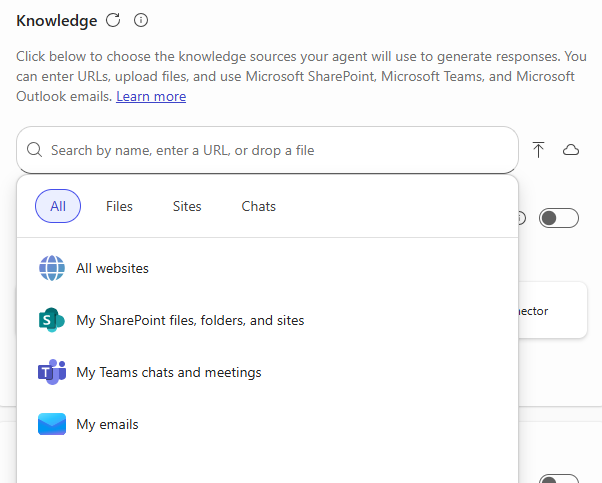

---
demo:
  title: Copilot Studio로 에이전트 빌드
---

[인덱스로 돌아가기](https://microsoftlearning.github.io/MS-4021-Copilot-Immersion-Experience/)

---

# Copilot Chat을 사용하여 에이전트 빌드 및 게시

이 데모에서는 Copilot Chat을 통해 Copilot Studio를 사용하여 가상 도우미를 빌드하고 Microsoft 365 Copilot에 게시하는 방법을 안내합니다.

## 데모 설정

이러한 데모를 완료하려면 다음 파일을 다운로드해야 합니다.

- [**Delivery Drone Press Release.docx**](https://github.com/MicrosoftLearning/MS-4008-Microsoft-365-Copilot-Interactive-Experience-for-Executives/raw/master/ResourceFiles/Delivery_Drone_Press_Release.docx)
- [**Delivery Drone Troubleshooting.docx**](https://github.com/MicrosoftLearning/MS-4008-Microsoft-365-Copilot-Interactive-Experience-for-Executives/raw/master/ResourceFiles/Delivery_Drone_Troubleshooting.docx)
- [**Delivery Drone SOP.docx**](https://github.com/MicrosoftLearning/MS-4008-Microsoft-365-Copilot-Interactive-Experience-for-Executives/raw/master/ResourceFiles/Delivery_Drone_SOP.docx)
- [**Upselling Opportunities.docx**](https://github.com/MicrosoftLearning/MS-4008-Microsoft-365-Copilot-Interactive-Experience-for-Executives/raw/master/ResourceFiles/Upselling_Opportunities.docx)
- [**Delivery Drone FAQ.docx**](https://github.com/MicrosoftLearning/MS-4008-Microsoft-365-Copilot-Interactive-Experience-for-Executives/raw/master/ResourceFiles/Delivery_Drone_FAQ.docx)

> **팁:** 데모를 진행하기 전에 데모 환경에 SharePoint 사이트를 만들어 쉽게 액세스할 수 있도록 모든 파일을 저장합니다. 또는 파일을 로컬에 저장한 다음, **/** 를 사용하여 프롬프트에서 직접 참조할 수도 있습니다.

## 핵심 요지

Copilot Studio를 사용하면 특정 프로젝트, 부서, 기술 자료에 맞게 조정된 사용자 지정 Copilot을 빌드할 수 있습니다. Copilot에게 개성을 부여하고, 범위를 설정하며, 특정 문서를 제공하여 고품질의 신뢰할 수 있는 응답을 보장할 수 있습니다.

이 데모에서는 ReleCloud 드론 배달 프로젝트를 위한 가상 도우미를 만들어 보겠습니다. 이 도우미는 업로드한 모든 내용을 이해하고 팀의 질문에 답변하여 시간을 절약하고 생산성을 향상시키는 데 도움이 됩니다.

## 데모 단계

### 1단계 – Copilot Studio로 이동

1. [https://m365.cloud.microsoft/chat](https://m365.cloud.microsoft/chat)으로 이동하여 오른쪽 레일에서 **에이전트 만들기**를 선택합니다.

    

1. 자격 증명을 사용하여 로그인합니다.

### 2단계 - 에이전트 정의

1. 프롬프트가 표시되면 다음 설명을 추가합니다.

    ```text
    You're a virtual project manager assistant for our drone delivery project. You know everything about the project from the documents we've shared with you, and are happy to help team members get the information they need.
    ```

   

1. 도우미 이름 지정:

    ```text
    Drone Delivery Assistant
    ```

1. 확인 요청 시:

    ```text
    Yes, thank you
    ```

1. 피해야 할 사항 또는 강조할 사항을 묻는 경우:

    ```text
    Please be clear and concise and avoid long answers. Where possible, refer primarily to the knowledge shared with you. If you don't know the answer, refer them to the drone delivery project manager.
    ```

1. 목소리 톤을 묻는 경우:

    ```text
    Friendly and professional
    ```

> **중요:**  사용자 환경에 따라 이러한 옵션이 모두 프롬프트에 표시되지 않을 수도 있습니다. 프롬프트가 표시되지 않으면 Copilot Studio 내의 **구성** 탭을 사용하여 이 정보를 추가할 수 있습니다.

### 3단계 - 에이전트 구성

1. **구성**을 클릭하여 에이전트 편집기를 엽니다.
1. **지침** 섹션을 검토하고 선택적으로 업데이트하세요.

    ```text
    Your name is Drone Delivery Project Manager Assistant. You serve as a virtual project manager for the ReleCloud drone delivery project, with comprehensive knowledge from shared documents. Be clear and concise, avoiding long answers. If the answer is unknown, refer to the drone delivery project manager.
    ```

1. **기술 자료** 섹션까지 아래로 스크롤하여 **이름으로 검색하거나 URL 입력** 텍스트 단추를 클릭하세요. **파일**을 선택하고 다음 문서를 에이전트의 기술 자료에 추가합니다.

    - **Delivery Drone Press Release.docx**
    - **Delivery Drone Troubleshooting.docx**
    - **Delivery Drone SOP.docx**
    - **Upselling Opportunities.docx**
    - **Delivery Drone FAQ.docx**

        

### 4단계 - 에이전트 테스트

오른쪽 테스트 창에서 다음 질문 중 몇 가지를 질문해 보세요.

- `Tell me about the ReleCloud Delivery Drone.`
- `How do I fix the drone error code D-101?`
- `What are the upsell opportunities for ReleCloud?`
- `What’s the duration of Phase 1 of the delivery drone project?`

> **중요:**   에이전트가 문서를 처리하고 정확한 답변을 제공하는 데 다소 시간이 걸릴 수 있습니다. 오류 메시지가 표시되면 몇 분 정도 기다렸다가 다시 시도하세요.

> **팁:** 에이전트가 라이브 상태가 되면 Microsoft Teams를 통해 테스트할 수도 있습니다.

### 5단계 – 게시 및 공유

1. **만들기**를 클릭하여 에이전트를 게시합니다.
1. **공유 설정 변경**을 선택하고 **조직의 모든 사용자**를 선택합니다.
1. 공유 링크를 복사하여 Teams 채팅에 붙여넣으면 쉽게 액세스할 수 있습니다.

라이브 상태가 되면 Teams 채팅이나 @mentions를 통해 에이전트와 상호 작용할 수 있습니다.

[인덱스로 돌아가기](https://microsoftlearning.github.io/MS-4021-Copilot-Immersion-Experience/)
