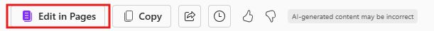
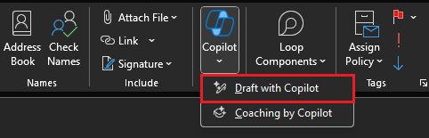

---
task:
  title: 몰입 환경 - 비즈니스 관리자
---

## 몰입 환경 - 비즈니스 관리자  

커뮤니케이션을 검토하고, 전자 메일을 보내고, 예정된 모임을 준비하여 일상적인 작업을 최적화합니다.  

다음 세 가지 작업을 수행합니다.  

- **Microsoft 365 Copilot Chat**을 사용하여 커뮤니케이션을 검토합니다.  
- **Pages에서 Copilot**을 사용하여 모임 대화 요점을 준비합니다.
- **Outlook의 Copilot**을 사용하여 후속 이메일을 작성합니다.  

> **참고:** 시작하는 데 도움이 되는 샘플 프롬프트가 제공됩니다. 필요에 맞게 자유롭게 개인화하여 창의력을 발휘하고 탐색해 보세요! Copilot이 원하는 결과를 제공하지 않는 경우 프롬프트를 수정하고 다시 시도합니다. 과정을 즐기고 재미있게 실험해 보세요!  

### 작업 1: 커뮤니케이션 검토  

**Microsoft 365 Copilot Chat**을 사용하여 특정 주제 또는 프로젝트에 대한 특정 사람과의 최근 상호 작용에서 인사이트를 수집합니다. 핵심 사항, 작업 항목 및 미해결 질문을 식별하는 데 집중합니다. 이렇게 하면 팀 프로젝트를 최신 상태로 유지하고 이해 관계자에게 진행 상황, 과제 및 결과를 알릴 수 있습니다.  

**단계:**

- 새 브라우저 탭을 열고 [M365copilot.com](https://m365copilot.com/)으로 이동합니다.
- Copilot Chat에서 "작업 모드" 탭이 선택되어 있는지 확인합니다.

    

**샘플 프롬프트**:

```text
Summarize my recent interactions with [/Name of Person] regarding [specific topic or project]. Organize the summary by key points or actions discussed, and include any follow-up items or outstanding questions that may require attention.
```

> **참고:** [사람 이름]을 해당 사람으로, [특정 주제 또는 프로젝트]를 관련 주제로 바꿉니다. **/** 문자(슬래시)를 사용하여 내부 연락처를 참조하면 최근 상호 작용에 빠르게 액세스할 수 있습니다.

### 작업 2: 모임 준비  

**Pages에서 Copilot**을 사용하여 Microsoft 365 Copilot Chat에서 수집한 인사이트를 기반으로 예정된 이해 관계자 모임을 위한 대화 요점을 만듭니다. 진행률 업데이트, 주요 날짜, 과제 또는 위험 및 실행 가능한 다음 단계에 집중하여 생산적인 토론을 보장합니다.

**단계:**

1. 이전 작업의 **Copilot Chat의 응답**에서 **Pages에서 Edit**를 선택합니다.  
   

2. 새 Pages 화면이 열리면 **모든 Pages 보기**를 선택합니다.  
   

3. 새 Pages 창에서 문서 오른쪽에 있는 **Copilot 아이콘**을 선택하여 Copilot과 상호작용합니다.

**샘플 프롬프트**:

```text
Using these insights, draft talking points for an upcoming stakeholder meeting. Focus on progress updates, key dates, challenges and next steps. 
```

> **팁:**  
> - Pages를 공동 작업 공간으로 사용하여 동료와 실시간으로 작업할 수 있습니다. "@" 기호 다음에 동료의 이름을 입력하여 페이지를 공유합니다.
> - 동료를 추가한 후 동료의 이름을 클릭하여 액세스 권한을 부여합니다. 해당 페이지에서 공동 작업할 수 있는 링크가 포함된 이메일 알림을 받게 됩니다.  

### 작업 3: 후속 전자 메일 보내기  

**Outlook의 Copilot**을 사용하여 Microsoft 365 Copilot Chat에서 수집한 인사이트를 기반으로 후속 전자 메일 초안을 작성합니다. 진행률 업데이트, 보류 중인 액션, 다음 단계 및 추가 논의를 위한 후속 모임 요청과 같은 세부 정보를 포함합니다.

**단계:**

- **Outlook**에서 **새 이메일**을 선택한 다음 리본에서 **Copilot** > **Copilot으로 초안 작성**을 선택합니다.

    

**샘플 프롬프트**:

```text
Using the insights below, draft a follow-up email to [Name of Person] requesting an update on progress and next steps. Also, ask for a follow-up meeting to discuss further on the project deadline. 

[Paste insights from Copilot Chat here, or add your own insights]
```
