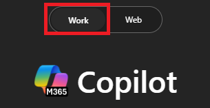
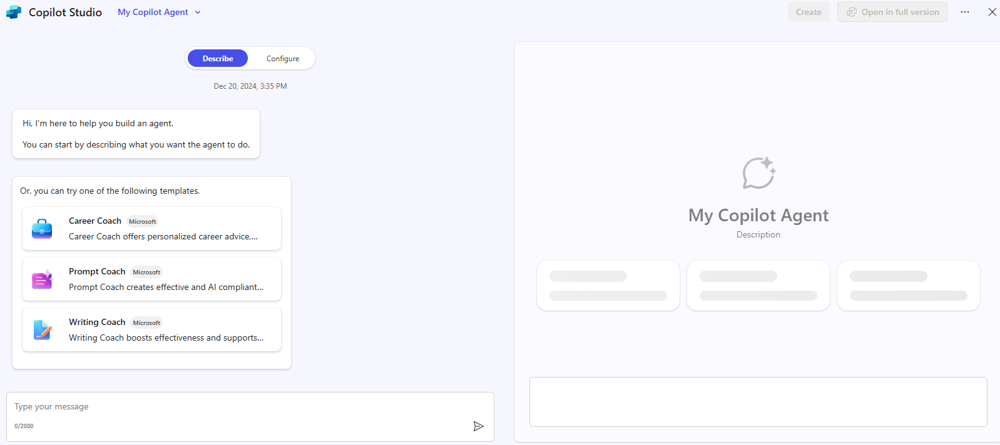

---
task:
  title: 몰입형 환경 – 에이전트(비즈니스 사용자)
---

## 몰입형 환경 – 에이전트(비즈니스 사용자)

Microsoft 365 Copilot 및 Copilot Studio가 간단한 **검색 기반 에이전트**를 설계하여 일상적인 생산성 과제를 해결하는 데 어떻게 도움이 되는지 알아보세요. 이 간소화된 연습에서는 일반적인 문제를 식별하고, AI가 어떻게 도움이 될 수 있는지 알아보고, 테스트할 간단한 에이전트를 만드는 과정을 안내합니다.  

다음 세 가지 작업을 수행합니다.

- 생산성 문제 파악  
- AI가 검색 및 조직에 어떻게 도움이 되는지 살펴보기  
- **Copilot Studio**에서 간단한 에이전트 빌드 및 테스트  

> **참고:** 시작하는 데 도움이 되는 샘플 프롬프트가 제공됩니다. 상황에 맞게 개인 설정하여 사용할 수 있습니다.  
>
> 프롬프트 생성이나 개선에 도움이 필요하다면 <a href="https://appsource.microsoft.com/en-us/product/office/WA200007578" target="_blank">프롬프트 코치 에이전트</a>를 사용해 보세요. 이 에이전트는 프롬프트를 제안, 개선, 평가하여 Copilot을 통해 더 나은 결과를 얻을 수 있도록 도와줍니다.

### 작업 1: 생산성 과제 식별  

일상적인 작업에서 흔히 발생하는 문제를 떠올려 보세요. 이러한 문제로 인해 속도가 느려지거나 정보를 찾고 정리하기가 더 어려워질 수 있습니다. 개인적으로 생각해 볼 수도 있고, **Copilot Chat**을 파트너를 활용해 아이디어를 얻고 일반적인 문제점을 파악하는 데 도움을 받을 수도 있습니다.

예:

- 문서의 최신 버전 찾기  
- 여러 메일 또는 채팅에서 업데이트 수집  
- 이전 프로젝트 또는 모임의 세부 내용 기억  

**단계:**  

- 새 브라우저 탭을 열고 [m365.cloud.microsoft/chat](https://m365.cloud.microsoft/chat)으로 이동하세요. 

- **Copilot Chat**에서 **작업 모드** 탭이 선택되어 있는지 확인합니다.  

     

    **샘플 프롬프트**:

    ```text
    Summarize the top challenges I face in my daily work, based on recent emails, chats, and documents. Show results in a simple list with: 
    
    - Title (short label for the issue) 
    - Description (1–2 sentences) 
    ```  

### 작업 2: 리서치 도구를 통해 AI 솔루션 아이디어 살펴보기  

**리서치 에이전트**를 사용하여 Copilot이나 에이전트가 선택한 과제에 어떻게 도움을 줄 수 있는지 알아보세요.

**단계:**  

- Copilot Chat 메뉴에서 **에이전트**를 확장하고 (필요한 경우) **리서치 도구**를 선택합니다.  

     

- 다음과 같은 샘플 프롬프트를 사용해 보세요.  

   ```text
   Explore possible AI solutions to help with [insert productivity issue]. Focus on retrieval-based approaches using Microsoft Copilot or Copilot Studio agents. Summarize two or three ways an agent could help me find, organize, or summarize information more efficiently.
   ```  

    > **팁:** 문서를 빠르게 찾아내거나 여러 소스에서 업데이트를 가져오는 것처럼, 실용적이고 일상적인 활용 사례에 초점을 맞춰 보세요.
  
    > **참고:** 리서치 도구는 사용자의 요청에 따라 완료하는 데 5~10분(또는 그 이상)이 걸릴 수 있습니다. 응답 내용이 매우 자세하므로 작동하는 동안 Copilot Chat에서 동일한 프롬프트를 실행해 보세요. 두 가지 출력을 비교하면 각 도구가 작업에 어떻게 접근하는지 파악하는 데 큰 도움이 됩니다.

### 작업 3: 에이전트 빌드 및 테스트  

이제 **Copilot Studio 라이트**에서 간단한 검색 에이전트를 만들어 과제를 해결하세요.  

**단계:**  

1. **Copilot Chat** 메뉴에서 **에이전트 만들기**를 선택하세요.

     

1. **설명** 탭에서 에이전트의 역할 초안을 작성합니다. 예시:  

   ```text
   You’re a virtual assistant that helps me with [key task]. Be concise and always reference my recent files or resources when possible.
   ```  

     

1. **구성** 탭을 선택하고 하나의 기술 자료 원본(예: **내 메일** 또는 **내 Teams 채팅 및 모임**)을 추가하세요.

    

1. **테스트** 창을 사용하여 에이전트를 테스트하고 필요에 따라 개선해 보세요.  
1. **만들기**를 선택하여 에이전트를 게시하고 사용을 시작해 보세요.  

> **팁:** 최근 프로젝트 파일을 찾는 데 도움이 되는 매우 간단한 에이전트조차도 일상적인 작업에서 검색 기능의 강력함을 보여줄 수 있습니다.
