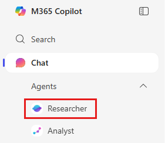
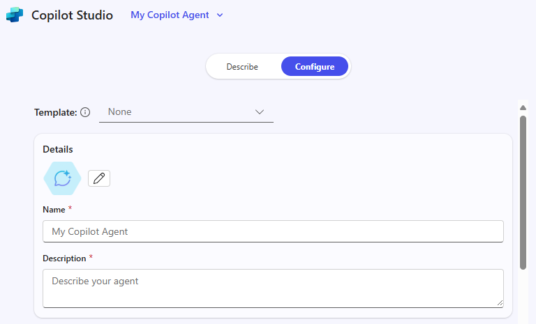

---
task:
  title: 몰입형 환경 – 에이전트(임원)
---

## 몰입형 환경 – 에이전트(임원)

Microsoft 365 Copilot과 Copilot Studio가 간단한 **검색 기반 에이전트**를 설계하여 실제 업무 관련 과제를 해결하는 데 어떻게 도움이 될 수 있는지 알아보세요. 이 연습에서는 문제를 식별하고, 이 문제를 세분화하고, AI가 어떻게 도움이 될 수 있는지 탐색한 다음, 해결하기 위한 개념적 에이전트를 만드는 과정을 안내합니다.  

다음 네 가지 작업을 수행합니다.

- 작업 관련 문제 식별  
- 문제를 분석하고 AI가 어떻게 도움이 될 수 있는지 살펴보기  
- **리서치 도구**를 사용하여 인사이트 및 솔루션 아이디어 찾아보기  
- **Copilot Studio**에서 검색 기반 에이전트 개념화 및 모형화  

> **참고:** 시작하는 데 도움이 되는 샘플 프롬프트가 제공됩니다. 상황에 맞게 개인 설정하여 사용할 수 있습니다. 
>
> 프롬프트를 생성하거나 또는 개선하는 데 도움이 필요한 경우, <a href="https://appsource.microsoft.com/en-us/product/office/WA200007578" target="_blank">프롬프트 코치 에이전트</a>를 사용해 보세요.<br>Copilot을 사용하여 더 나은 결과를 얻을 수 있도록 프롬프트를 제안, 개선, 평가할 수 있습니다.

### 작업 1: 작업 관련 과제 식별  

먼저, 역할에서 발생하는 실제 문제에 대해 생각해 보세요. 이 문제로 인해 속도가 느려지거나 정보에 액세스하기가 더 어려워질 수 있습니다. 개인적으로 생각해 볼 수도 있고, **Copilot Chat**을 파트너로 활용해 아이디어를 얻고 기술 자료를 검색하고 정리하여 효과를 발휘할 수 있는 과제를 식별할 수도 있습니다.  

생각을 정리하는 데 도움이 되도록, 다음을 고려해 보세요.  

- **현재 잘 작동하고 있는 기능**  
- **잘 작동하지 않는 기능**  
- **AI*가* 도움이 될 수 있는 부분**  

**단계:**  

- 새 브라우저 탭을 열고 [m365.cloud.microsoft/chat](https://m365.cloud.microsoft/chat)으로 이동하세요.  
- **Copilot Chat**에서 **작업 모드** 탭이 선택되어 있는지 확인하세요.  

     

    **샘플 프롬프트**:

   ```text
   I’m researching common day-to-day issues I face at work, such as processes, collaboration, or time management. Look at recent conversations from [Teams chats, Outlook emails, or other collaboration tools] related to [your role focus]. Summarize the key issues or pain points mentioned in the last 6 months. Show the results in a table with:  

    - Title: Short label for the issue  
    - Description: Brief summary of the challenge  
    - Frequency: How often it comes up (e.g., number of mentions)
   ```

### 작업 2: 문제 분석

**Copilot Chat**을 사용하여 작업 1에서 식별한 과제를 더 작은 부분으로 나누어 보세요.

- 이 문제가 어려운 이유는 무엇인가요?  
- 정보가 막히거나 사라지는 지점은 어디인가요?  
- 가장 큰 영향을 받는 사람은 누구인가요?  

**다음과 같은 샘플 프롬프트를 사용해 보세요.**

```text
Break down the problem of [insert challenge]. Identify root causes, pain points, and which areas of work are most affected.
 ```

> **팁:** 기술 자료 검색이 시간을 절약하거나 팀이 더 빠르게 의사 결정을 내리는 데 도움이 될 수 있는 부분을 생각해 보세요.

### 작업 3: 리서치 도구를 통해 AI 솔루션 아이디어 살펴보기

**리서치 도구 에이전트**를 사용하여 Copilot과 에이전트가 어떻게 도움을 줄 수 있는지 확인해 보세요. 작업을 자동화하지 않고 기술 자료를 검색, 정리, 요약하는 솔루션에 집중하세요. 

**단계:**

- 새 브라우저 탭을 열고 [m365.cloud.microsoft/chat](https://m365.cloud.microsoft/chat)으로 이동하세요.
- Copilot Chat 메뉴에서 **에이전트**를 확장하고 (필요한 경우) **리서치 도구**를 선택합니다.

      

    **샘플 프롬프트(리서치 도구 에이전트):**

    ```text
    Explore possible AI solutions to address [insert problem]. Focus on retrieval-based approaches using Microsoft Copilot, Copilot Studio agents, or connected knowledge sources. Summarize three possible solution approaches, their benefits, and limitations.
    ```

    > **팁:** 기술 자료를 더 쉽게 찾고, 재사용하고, 공유할 수 있도록 에이전트가 도울 수 있는 기회를 찾아보세요.

    > **참고:** 리서치 도구는 사용자의 요청에 따라 완료하는 데 5~10분(또는 그 이상)이 걸릴 수 있습니다. 응답 내용이 매우 자세하므로 작동하는 동안 Copilot Chat에서 동일한 프롬프트를 실행해 보세요. 두 가지 출력을 비교하면 각 도구가 작업에 어떻게 접근하는지 파악하는 데 큰 도움이 됩니다.

### 작업 4: 에이전트 빌드

이제 인사이트를 바탕으로 **Copilot Studio 라이트**에서 간단한 모의 에이전트를 만들어 보세요. 검색에 집중하세요. 에이전트가 정보를 노출, 정리, 요약하는 데 도움이 됩니다.

**단계:**

- **Copilot Studio 라이트에서 시작**

    1. 브라우저를 열고 [m365.cloud.microsoft/chat](https://m365.cloud.microsoft/chat)으로 이동하세요.
    1. 탐색 창에서 **에이전트 만들기**를 선택하여 **Copilot Studio**를 실행하세요.

        

- **에이전트 정의(설명 탭 또는 구성 탭)**

    1. 사용 가능한 경우 **설명** 탭을 선택하고 이 샘플 프롬프트를 사용하거나 직접 작성하세요.

        ```text
        You’re a virtual assistant for our [project/team name]. Your role is to help with [key tasks]. Be concise, stay on-brand, and reference our shared resources when possible.
        ```

        

        > **참고:** 처음부터 시작할 수도 있고, 나중에 사용자 지정할 수 있는 설정 및 지침이 미리 입력된 템플릿을 기반으로 에이전트를 만들 수도 있습니다.

    1. **설명** 탭이 사용 가능한 경우 이전 단계를 수행했습니다. 사용할 수 없는 경우 **구성** 탭으로 전환하여 이름, 설명, 에이전트 지침 등 동일한 세부 정보를 수동으로 입력합니다.

        

- **에이전트 사용자 지정**

    **구성** 탭에서 다음 옵션을 살펴보세요.

    1. 최소한 하나 이상의 기술 자료 원본(예: OneDrive/SharePoint에 저장된 문서 또는 메일)을 추가하세요.

        

    1. 다른 사용자가 에이전트를 시작할 수 있도록 시작 프롬프트 정의

        

        > **팁:** 시작 프롬프트는 사용자가 에이전트와 상호 작용하는 방법을 안내하는 데 도움이 됩니다.

- **테스트 및 만들기**

    1. 에이전트 구축 과정 전체에서 오른쪽 창에 있는 **테스트** 기능을 사용하여 에이전트의 초안 버전을 실행해 보고 문제점을 개선하세요.
    2. 만족스러우면 **만들기**를 선택하여 에이전트를 게시하세요.
    3. 에이전트를 다른 사용자와 공유하거나 즉시 사용할 수 있도록 열어 보세요.  

> **팁:** 오늘 당장 완벽한 에이전트를 만드는 것이 목표는 아닙니다. 목표는 검색 중심 에이전트가 일상적인 작업에서 기술 자료에 더 쉽게 액세스할 수 있도록 하는 방법을 살펴보는 것입니다.
