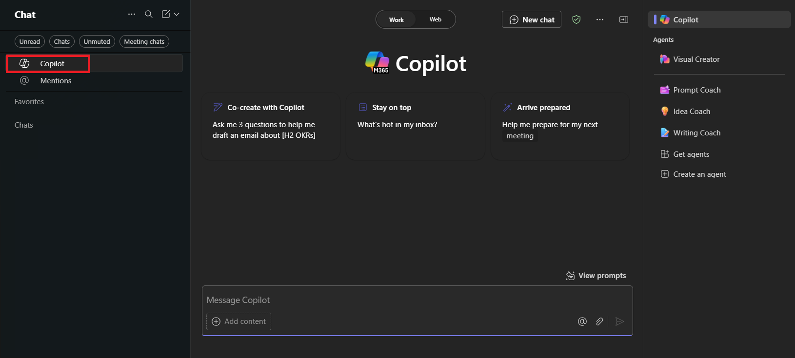

---
task:
  title: 몰입 환경 - 영업
---

## 몰입 환경 - 영업

최근 고객 상호 작용에서 인사이트를 수집하고, 주요 작업 항목에 맞게 조정하고, 예정된 고객 모임을 준비합니다.

다음 세 가지 작업을 수행합니다.

- **Microsoft 365 Copilot Chat**을 사용하여 인사이트 수집하기
- **Outlook의 Copilot**을 사용하여 작업 항목 정렬
- **Word의 Copilot**을 사용하여 고객 모임 준비

> **참고:** 시작하는 데 도움이 되는 샘플 프롬프트가 제공됩니다. 필요에 맞게 자유롭게 개인화하여 창의력을 발휘하고 탐색해 보세요! Copilot이 원하는 결과를 제공하지 않는 경우 프롬프트를 수정하고 다시 시도합니다. 과정을 즐기고 재미있게 실험해 보세요!

### 작업 1: 인사이트 수집

**Microsoft 365 Copilot Chat**(팀 단위)을 사용하여 프로젝트 구현과 관련하여 최근 고객과의 상호 작용에서 얻은 인사이트를 수집하고 검토합니다. 이러한 인사이트는 고객의 관심사, 진행 상황 및 향후 참여 중에 해결할 수 있는 새로운 기회를 이해하는 데 도움이 됩니다.

**단계:**

- **Microsoft Teams**의 **채팅** 창 상단에서 **Copilot**을 선택합니다.  그러면 **Copilot** 창이 열립니다.

    

- Copilot Chat에서 "작업 모드" 탭이 선택되어 있는지 확인합니다.

    

**샘플 프롬프트**:

```text
Summarize my recent interactions with [/Name of Person] regarding [specific customer / topic / project]. Organize the summary by key points or actions discussed, and include any follow-up items or outstanding questions that may require attention.
```

> **참고:** [사람 이름]을 집중하고 있는 사람으로 바꾸고 [특정 고객/토픽/프로젝트]를 관련 항목으로 바꿉니다. **/** 문자(슬래시)를 사용하여 내부 연락처를 참조하면 최근 상호 작용에 빠르게 액세스할 수 있습니다.

### 작업 2: 작업 항목에 맞춤

**Outlook의 Copilot**을 사용하여 Copilot Chat에서 수집한 인사이트를 바탕으로 후속 이메일 초안을 작성합니다. 열린 작업 항목을 포함하고, 책임을 명확히 하고, 동료 또는 팀에 업데이트를 제공하여 맞춤 및 책임을 보장합니다.

**단계:**

- **Outlook**에서 **새 이메일**을 선택한 다음 리본에서 **Copilot** > **Copilot으로 초안 작성**을 선택합니다.

    

**샘플 프롬프트**:

```text
Using the insights below, draft a follow-up email to [Name of Person] highlighting the key actions and next steps. Also, ask for a follow-up meeting to discuss further.

[Paste insights from Copilot Chat here]
```

### 작업 3: 고객 모임 준비

**Word의 Copilot**을 사용하여 예정된 고객 상태 업데이트 모임의 대화 요점을 작성합니다. 대화 요점이 주요 결과물에 초점을 맞추고, 고객 우선 순위를 해결하고, 다음 단계에서 명확성을 제공하는지 확인합니다.

**단계:**

- 브라우저([word.new](https://word.new))에서 Microsoft Word를 시작하거나 데스크톱 응용 프로그램을 사용합니다.
- **"작성하고 싶은 내용을 설명하세요"** 라고 표시된 곳에 프롬프트를 입력합니다.

    

**샘플 프롬프트**:

```text
Using the insights below, draft talking points for an upcoming status update meeting with [Customer Name]. Focus on any challenges and next steps.

[Paste insights from Copilot Chat here, or add your own insights]
```
